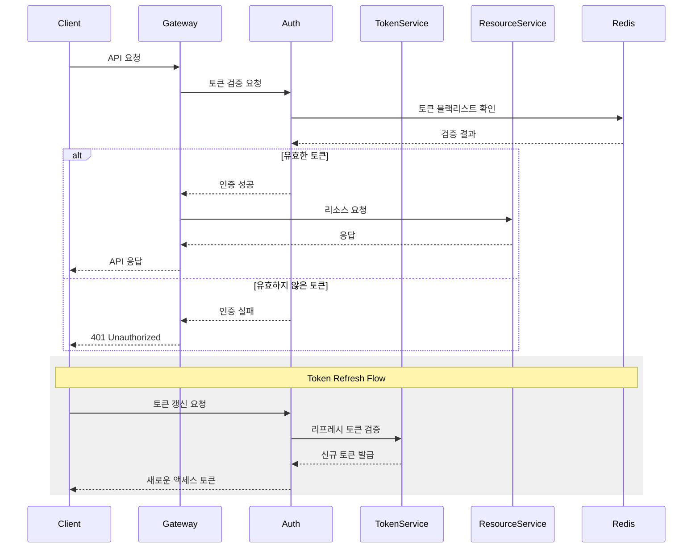
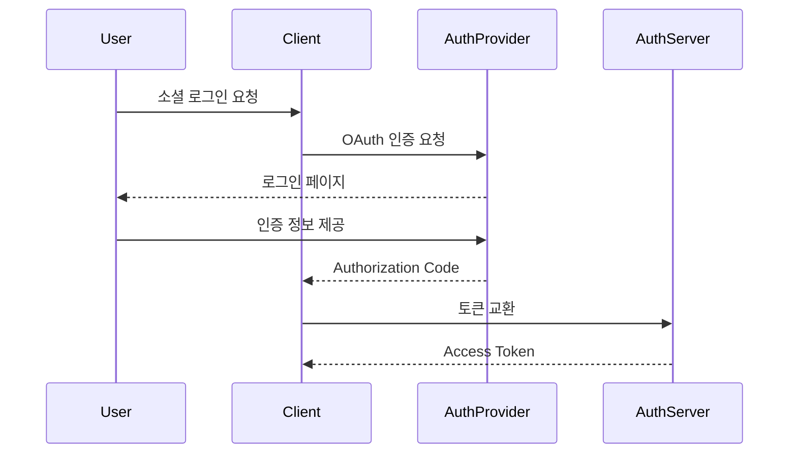

# API 인증/인가 방식

## API 인증/인가 설계 문서

### 1. 인증/인가 시스템 아키텍처




### 2. 인증 시스템 (Authentication)

#### 2.1 다중 인증 전략

**JWT 기반 인증**

```json
{
  "header": {
    "alg": "RS256",
    "typ": "JWT"
  },
  "payload": {
    "sub": "user123",
    "roles": ["USER", "CREATOR"],
    "permissions": ["READ", "WRITE"],
    "room_id": "room123",
    "exp": 1704796800,
    "iat": 1704793200
  }
}
```

**채택 이유**:

* 무상태성으로 서버 부하 감소
* 마이크로서비스 간 토큰 공유 용이
* 클레임 기반의 유연한 권한 관리
* 토큰 자체 검증 가능으로 DB 조회 불필요

**OAuth 2.0 통합**




**채택 이유**:

* 신뢰할 수 있는 제3자 인증
* 사용자 경험 향상
* 보안 강화 (패스워드 관리 부담 감소)
* 소셜 기능 통합 용이

#### 2.2 토큰 관리 전략

**토큰 수명주기**

* Access Token: 1시간
* Refresh Token: 2주
* Remember Me Token: 30일

**설계 이유**:

* 보안과 사용자 편의성 균형
* 주기적 토큰 갱신으로 보안 강화
* 장기 세션 지원으로 UX 개선

**토큰 저장소**

```javascript
// Redis Token Store Structure
{
  "refresh_tokens": {
    "user123": {
      "token": "rt_abc123",
      "expires_at": 1704796800,
      "device_info": "iPhone 12, iOS 15.0"
    }
  },
  "blacklist": {
    "at_xyz789": {
      "expires_at": 1704793200,
      "reason": "user_logout"
    }
  }
}
```

**설계 이유**:

* 빠른 토큰 검증
* 토큰 취소 기능 지원
* 디바이스별 세션 관리
* 보안 이벤트 추적

### 3. 인가 시스템 (Authorization)

#### 3.1 RBAC (Role Based Access Control)

```json
{
  "roles": {
    "USER": {
      "permissions": ["READ_POST", "WRITE_POST", "READ_PROFILE"],
      "description": "기본 사용자 권한"
    },
    "CREATOR": {
      "permissions": ["READ_POST", "WRITE_POST", "DELETE_POST", "MONETIZE"],
      "description": "콘텐츠 제작자 권한"
    },
    "ADMIN": {
      "permissions": ["*"],
      "description": "관리자 권한"
    }
  }
}
```

**채택 이유**:

* 역할 기반의 직관적 권한 관리
* 권한 변경의 용이성
* 스케일러블한 권한 구조
* 감사(Audit) 용이성

#### 3.2 리소스 기반 접근 제어

```javascript
// Room Access Policy Example
async function checkRoomAccess(user, room) {
  if (user.hasRole('ADMIN')) return true;
  if (room.owner.id === user.id) return true;
  if (room.visibility === 'PUBLIC') return true;
  if (room.visibility === 'FRIENDS_ONLY') {
    return await checkFriendship(user.id, room.owner.id);
  }
  return false;
}
```

**채택 이유**:

* 세밀한 접근 제어 가능
* 동적 권한 평가 지원
* 컨텍스트 기반 결정
* 유연한 정책 변경

#### 3.3 속성 기반 접근 제어 (ABAC)

```json
{
  "policies": {
    "room_access": {
      "conditions": [
        {
          "attribute": "user.subscription",
          "operator": "equals",
          "value": "premium"
        },
        {
          "attribute": "room.level",
          "operator": "lessThanOrEqual",
          "value": "user.level"
        }
      ],
      "effect": "allow"
    }
  }
}
```

**채택 이유**:

* 복잡한 접근 규칙 지원
* 다차원 조건 평가 가능
* 비즈니스 규칙 통합
* 동적 정책 적용

### 4. 보안 강화 전략

#### 4.1 다중 요소 인증 (MFA)

```json
{
  "mfa_config": {
    "methods": ["TOTP", "SMS", "EMAIL"],
    "grace_period": 7,
    "required_for": ["PAYMENT", "PROFILE_UPDATE", "SECURITY_SETTINGS"]
  }
}
```

**구현 이유**:

* 계정 보안 강화
* 다양한 인증 옵션 제공
* 중요 작업 보호
* 규정 준수

#### 4.2 Rate Limiting

```javascript
// Rate Limit Configuration
{
  "limits": {
    "public_api": {
      "window": "1m",
      "max_requests": 60
    },
    "auth_endpoints": {
      "window": "5m",
      "max_requests": 5
    },
    "user_specific": {
      "window": "1h",
      "max_requests": 1000
    }
  }
}
```

**구현 이유**:

* DoS 공격 방지
* API 남용 방지
* 리소스 보호
* 공정한 사용 보장

### 5. 모니터링 및 감사

#### 5.1 보안 이벤트 로깅

```json
{
  "security_event": {
    "timestamp": "2024-01-09T10:00:00Z",
    "event_type": "AUTH_FAILURE",
    "user_id": "user123",
    "ip_address": "192.168.1.1",
    "user_agent": "Mozilla/5.0...",
    "failure_reason": "INVALID_TOKEN",
    "attempt_count": 3
  }
}
```

**구현 이유**:

* 보안 사고 탐지
* 사용자 행동 분석
* 규정 준수
* 포렌식 지원

#### 5.2 알림 시스템

```json
{
  "alert_rules": {
    "suspicious_login": {
      "conditions": ["new_device", "different_country"],
      "actions": ["email_user", "require_mfa"]
    },
    "brute_force": {
      "threshold": 5,
      "window": "5m",
      "actions": ["block_ip", "notify_admin"]
    }
  }
}
```

**구현 이유**:

* 실시간 보안 대응
* 사용자 알림
* 자동화된 보안 조치
* 관리자 모니터링
