# REST API 엔드포인트

```mermaid fullWidth="true"
graph TD
    %% Core Resources
    subgraph CoreResources["Core Resources"]
        User["Users"]
        Auth["Auth"]
        Meta["Meta"]
    end

    %% User Management
    subgraph UserManagement["User Management"]
        Profile["Profile"]
        Settings["Settings"]
        Preferences["Preferences"]
        Security["Security"]
    end
    User --> Profile
    User --> Settings
    User --> Preferences
    User --> Security

    %% Authentication
    subgraph Authentication
        Login["Login"]

        Register["Register"]
        OAuth["OAuth"]
        Token["Token"]
    end
    Auth --> Login
    Auth --> Register
    Auth --> OAuth
    Auth --> Token

    %% Meta Assets
    subgraph MetaAssets["Meta Assets"]
        Items["Items"]
        Collections["Collections"]
        Categories["Categories"]
        Store["Store"]
    end
    Meta --> Items
    Meta --> Collections
    Meta --> Categories
    Meta --> Store

    %% User Interactions
    subgraph UserInteractions["User Interactions"]
        Friends["Friends"]
        Blocks["Blocks"]
        Activity["Activity"]
    end
    Profile --> Friends
    Profile --> Blocks
    Profile --> Activity

    %% Security Management
    subgraph SecurityManagement["Security Management"]
        Password["Password"]
        TwoFactor["2FA"]
        Sessions["Sessions"]
    end
    Security --> Password
    Security --> TwoFactor
    Security --> Sessions

    %% Styling
    classDef resource fill:#f9f,stroke:#333,stroke-width:2px
    classDef endpoint fill:#bbf,stroke:#333,stroke-width:2px
    classDef subEndpoint fill:#dfd,stroke:#333,stroke-width:2px
    
    class User,Auth,Meta resource
    class Profile,Settings,Security,Login,Logout,Register,OAuth,Items,Collections,Categories endpoint
    class Password,TwoFactor,Sessions,Friends,Blocks,Activity subEndpoint
```



## Core Resources - Users API

```
Base URL: /api/v1/users

# 기본 사용자 관리
POST /                  # 새 사용자 생성
GET /{userId}          # 사용자 정보 조회
PUT /{userId}          # 사용자 정보 수정
DELETE /{userId}       # 사용자 삭제

# 프로필 관리
GET /{userId}/profile      # 프로필 정보 조회
PUT /{userId}/profile      # 프로필 정보 수정
PATCH /{userId}/profile    # 프로필 부분 수정

# 설정 관리
GET /{userId}/settings     # 사용자 설정 조회
PUT /{userId}/settings     # 사용자 설정 수정

# 환경설정
GET /{userId}/preferences  # 환경설정 조회
PUT /{userId}/preferences  # 환경설정 수정

# 보안 설정
GET /{userId}/security     # 보안 설정 조회
PUT /{userId}/security     # 보안 설정 수정
```

## Core Resources - Auth API

```
Base URL: /api/v1/auth

# 인증
POST /login              # 로그인
POST /logout             # 로그아웃
POST /register          # 회원가입

# OAuth 관리
GET /oauth/providers    # 지원하는 OAuth 공급자 목록
POST /oauth/{provider}  # OAuth 로그인 처리

# 토큰 관리
POST /token/refresh     # 토큰 갱신
POST /token/verify      # 토큰 검증
DELETE /token          # 토큰 폐기
```

## Core Resources - Meta API

```
Base URL: /api/v1/meta

# 아이템 관리
GET /items                # 아이템 목록 조회
GET /items/{itemId}       # 아이템 상세 조회
POST /items              # 새 아이템 생성
PUT /items/{itemId}      # 아이템 수정
DELETE /items/{itemId}   # 아이템 삭제

# 컬렉션 관리
GET /collections         # 컬렉션 목록 조회
POST /collections       # 새 컬렉션 생성
GET /collections/{id}    # 컬렉션 상세 조회
PUT /collections/{id}    # 컬렉션 수정

# 카테고리 관리
GET /categories         # 카테고리 목록
POST /categories       # 카테고리 생성
PUT /categories/{id}    # 카테고리 수정

# 스토어 관리
GET /store/items        # 스토어 아이템 목록
POST /store/purchase    # 아이템 구매
```

## User Interactions API

```
Base URL: /api/v1/users/{userId}/interactions

# 친구 관리
GET /friends           # 친구 목록 조회
POST /friends/{targetId} # 친구 추가
DELETE /friends/{targetId} # 친구 삭제

# 차단 관리
GET /blocks            # 차단 목록 조회
POST /blocks/{targetId} # 사용자 차단
DELETE /blocks/{targetId} # 차단 해제

# 활동 기록
GET /activities        # 활동 내역 조회
GET /activities/recent # 최근 활동 조회
```

## Security Management API

```
Base URL: /api/v1/users/{userId}/security

# 비밀번호 관리
PUT /password                  # 비밀번호 변경
POST /password/reset          # 비밀번호 초기화 요청

# 2FA 관리
GET /2fa/status              # 2FA 상태 조회
POST /2fa/enable            # 2FA 활성화
POST /2fa/disable           # 2FA 비활성화
POST /2fa/verify            # 2FA 코드 검증

# 세션 관리
GET /sessions               # 활성 세션 목록
DELETE /sessions/{sessionId} # 특정 세션 종료
DELETE /sessions            # 모든 세션 종료
```
