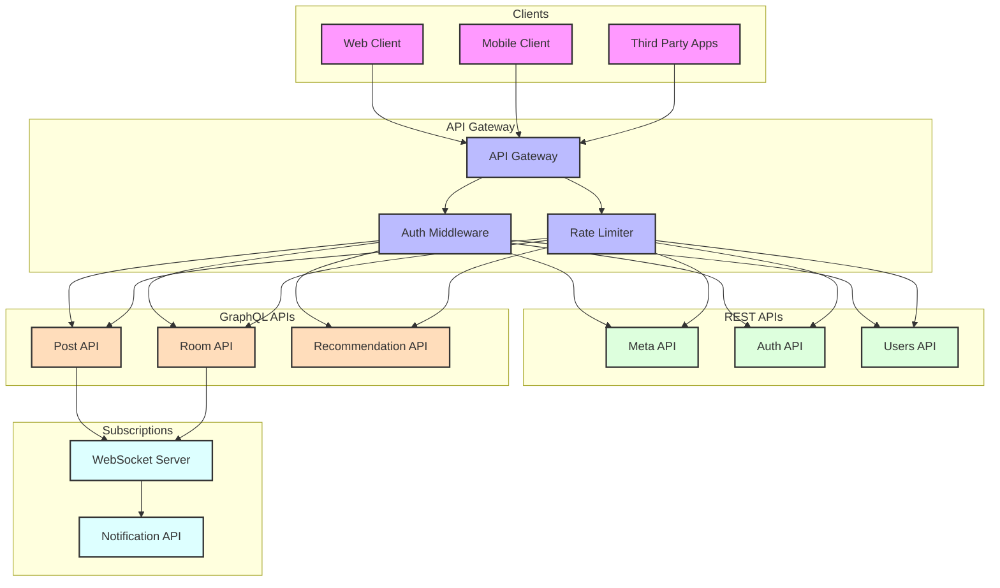

# API 설계 (REST/GraphQL)

## API 설계 전략

1. REST API 영역 (기본적인 CRUD 작업)
   * Meta API: 메타 에셋 관리
   * Auth API: 인증/인가 처리
   * Users API: 사용자 계정 관리, 프로필 관리
2. GraphQL API 영역 (복잡한 데이터 관계와 실시간 기능)
   * Post API: 게시물 관리 및 상호작용
   * Room API: 가상 공간 관리
   * Recommendation API: 개인화된 추천

***

## API 분리 결정 기준

1. REST API 선택 이유:
   * 단순하고 예측 가능한 CRUD 작업
   * 강력한 HTTP 캐싱 활용 가능
   * 서드파티 연동의 용이성
   * 파일 업로드 등 바이너리 데이터 처리
2. GraphQL API 선택 이유:
   * 복잡한 데이터 관계 처리 (게시물-댓글-리액션 등)
   * 실시간 업데이트 필요성 (Subscription)
   * 클라이언트별 최적화된 데이터 요청
   * 유연한 쿼리 구성
