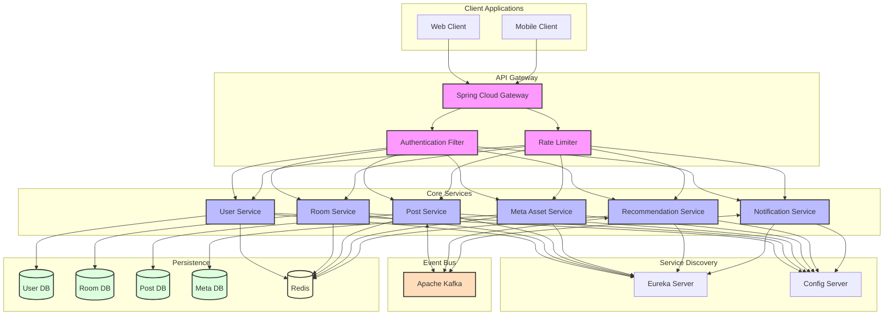

# 마이크로서비스 아키텍처

## 1. API Gateway Layer

### **Spring Cloud Gateway**

* **역할**:
  * 모든 클라이언트 요청의 단일 진입점
  * 라우팅 및 로드 밸런싱
  * 서비스 디스커버리 통합
* **선택 이유**:
  * 비동기 논블로킹 처리로 높은 성능
  * Spring Boot와의 원활한 통합
  * 유연한 라우팅 규칙 설정 가능

### **Authentication & Authorization**

* **기능**:
  * JWT 기반 인증
  * OAuth2.0 소셜 로그인
  * 역할 기반 접근 제어
* **구현 방식**:
  * Spring Security 활용
  * JWT 토큰 검증 필터
  * 권한 기반 라우팅

***

## 2. Core Services

### **User Service**

* **주요 기능**:
  * 사용자 프로필 관리
  * 인증/인가 처리
  * 팔로우/팔로워 관리
* **데이터 저장**:
  * PostgreSQL (사용자 기본 정보)
  * Redis (세션 및 캐시)

### **Room Service**

* **주요 기능**:
  * 가상 방 생성/관리
  * 방 커스터마이징
  * 방문 기록 관리
* **데이터 저장**:
  * MongoDB (방 구성 데이터)
  * Redis (실시간 방문 정보)

### **Post Service**

* **주요 기능**:
  * 게시물 CRUD
  * 태그 관리
  * 댓글/리액션 처리
* **이벤트 발행**:
  * 게시물 생성/수정/삭제 이벤트
  * 인기 게시물 집계 이벤트

### **Meta Asset Service**

* **주요 기능**:
  * 메타 이미지/아바타 관리
  * 에셋 카테고리 관리
  * CDN 연동
* **데이터 저장**:
  * MongoDB (에셋 메타데이터)
  * CDN (실제 에셋 파일)

### **Recommendation Service**

* **주요 기능**:
  * 인기 게시물 추천
  * 사용자 맞춤 추천
  * 랜덤 방문 추천
* **구현 방식**:
  * Apache Kafka 기반 실시간 처리
  * Redis 기반 랭킹 시스템

### **Notification Service**

* **주요 기능**:
  * 실시간 알림 처리
  * 이벤트 구독/발행
  * WebSocket 연결 관리
* **구현 방식**:
  * Kafka 기반 이벤트 처리
  * WebSocket을 통한 실시간 전송

***

## 3. Event Bus (Apache Kafka)

### **이벤트 기반 통신**

* **사용 목적**:
  * 서비스 간 느슨한 결합
  * 비동기 처리
  * 이벤트 소싱
* **주요 이벤트**:
  * 게시물 관련 이벤트
  * 사용자 활동 이벤트
  * 알림 이벤트

***

## 4. Service Discovery & Configuration

### **Eureka Server**

* **역할**:
  * 서비스 등록 및 발견
  * 헬스 체크
  * 로드 밸런싱 지원

### **Config Server**

* **역할**:
  * 중앙화된 설정 관리
  * 환경별 설정 분리
  * 동적 설정 갱신

***

## 5. 데이터 계층

### **Database 선택 기준**

* **PostgreSQL**: 사용자 데이터, 관계형 데이터
* **MongoDB**: 비정형 데이터 (방, 게시물, 메타 에셋)
* **Redis**: 캐시, 세션, 실시간 데이터

### 마이크로서비스 설계 원칙

1. **단일 책임 원칙**
   * 각 서비스는 명확한 비즈니스 도메인 담당
   * 독립적인 개발과 배포 가능
2. **데이터 분리**
   * 서비스별 독립적인 데이터베이스
   * 데이터 정합성을 위한 이벤트 기반 통신
3. **장애 격리**
   * Circuit Breaker 패턴 적용
   * Fallback 메커니즘 구현
4. **확장성**
   * 수평적 확장 가능한 설계
   * 컨테이너 기반 배포
