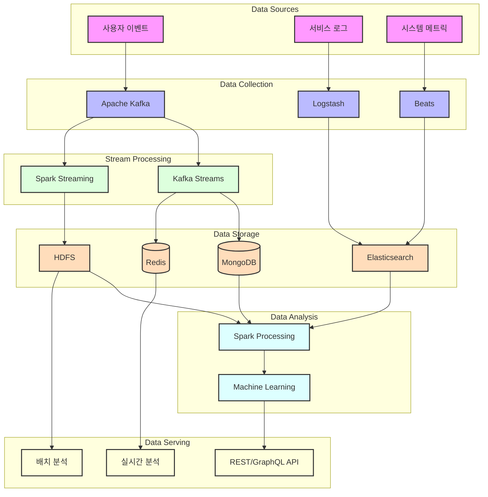

# 데이터 파이프라인 구조

## 데이터 파이프라인 계층별 특징

### 1. 데이터 소스 (Data Sources)

**사용자 이벤트**

* **수집 데이터**:
  * 사용자 활동 로그
  * 게시물 상호작용
  * 방문 기록
* **처리 방식**:
  * 실시간 스트림 처리
  * 이벤트 소싱 패턴 적용

**서비스 로그**

* **수집 대상**:
  * 애플리케이션 로그
  * 에러 로그
  * 성능 메트릭
* **활용 목적**:
  * 시스템 모니터링
  * 장애 분석
  * 성능 최적화

**시스템 메트릭**

* **측정 항목**:
  * 리소스 사용량
  * 응답 시간
  * 처리량
* **모니터링 목적**:
  * 시스템 헬스 체크
  * 성능 병목 감지
  * 용량 계획

***

### 2. 데이터 수집 계층 (Data Collection)

**Apache Kafka**

* **역할**:
  * 실시간 이벤트 수집
  * 데이터 버퍼링
  * 이벤트 브로커링
* **설계 고려사항**:
  * 높은 처리량 지원
  * 데이터 유실 방지
  * 확장성 확보

**Logstash**

* **주요 기능**:
  * 로그 데이터 수집
  * 데이터 파싱 및 변환
  * 다중 출력 지원
* **활용 방안**:
  * 구조화된 로그 생성
  * 실시간 로그 분석
  * 데이터 정제

**Beats**

* **용도**:
  * 경량 데이터 수집
  * 시스템 메트릭 모니터링
  * 로그 파일 전송
* **장점**:
  * 낮은 리소스 사용
  * 간편한 설정
  * 다양한 데이터 소스 지원

***

### 3. 스트림 처리 계층 (Stream Processing)

**Kafka Streams**

* **처리 대상**:
  * 실시간 사용자 활동
  * 실시간 추천
  * 알림 생성
* **구현 방식**:
  * 상태 기반 처리
  * 윈도우 연산
  * 조인 및 집계

**Spark Streaming**

* **활용 분야**:
  * 복잡한 데이터 처리
  * 머신러닝 모델 적용
  * 배치 분석 통합
* **처리 특징**:
  * 마이크로 배치 처리
  * 고성능 연산
  * 확장성 있는 처리

***

### 4. 데이터 저장 계층 (Data Storage)

**Elasticsearch**

* **저장 데이터**:
  * 검색 가능한 로그
  * 시스템 메트릭
  * 분석 결과
* **활용 목적**:
  * 실시간 검색
  * 로그 분석
  * 시각화

**HDFS**

* **저장 대상**:
  * 대용량 원본 데이터
  * 처리된 분석 결과
  * 히스토리 데이터
* **특징**:
  * 안정적인 저장
  * 확장 가능한 용량
  * 비용 효율적

**MongoDB & Redis**

* **역할 분담**:
  * MongoDB: 준실시간 데이터
  * Redis: 실시간 캐시
* **활용 방안**:
  * 빠른 데이터 접근
  * 실시간 집계
  * 임시 데이터 저장

***

### 5. 데이터 분석 계층 (Data Analysis)

**Spark Processing**

* **분석 유형**:
  * 배치 처리
  * 머신러닝 모델 학습
  * 데이터 집계
* **구현 방식**:
  * 분산 처리
  * 인메모리 연산
  * SQL 기반 분석

**Machine Learning**

* **적용 분야**:
  * 추천 시스템
  * 이상 감지
  * 트렌드 분석
* **모델 운영**:
  * 주기적 재학습
  * 실시간 예측
  * 모델 모니터링

***

### 6. 데이터 서빙 계층 (Data Serving)

**REST/GraphQL API**

* **제공 기능**:
  * 데이터 조회
  * 분석 결과 조회
  * 통계 정보 제공
* **특징**:
  * 유연한 쿼리
  * 캐시 적용
  * 보안 통제

**실시간/배치 분석**

* **서비스 형태**:
  * 대시보드
  * 리포트
  * 알림
* **제공 정보**:
  * 실시간 지표
  * 트렌드 분석
  * 예측 결과

***

## 데이터 파이프라인 설계 원칙

1. **확장성**
   * 수평적 확장 가능한 구조
   * 모듈식 구성요소
   * 유연한 리소스 할당
2. **신뢰성**
   * 데이터 유실 방지
   * 장애 복구 메커니즘
   * 데이터 정합성 보장
3. **실시간성**
   * 낮은 지연 시간
   * 실시간 처리 최적화
   * 즉각적인 피드백
4. **유지보수성**
   * 모니터링 용이성
   * 문제 추적 가능
   * 구성요소 독립성

