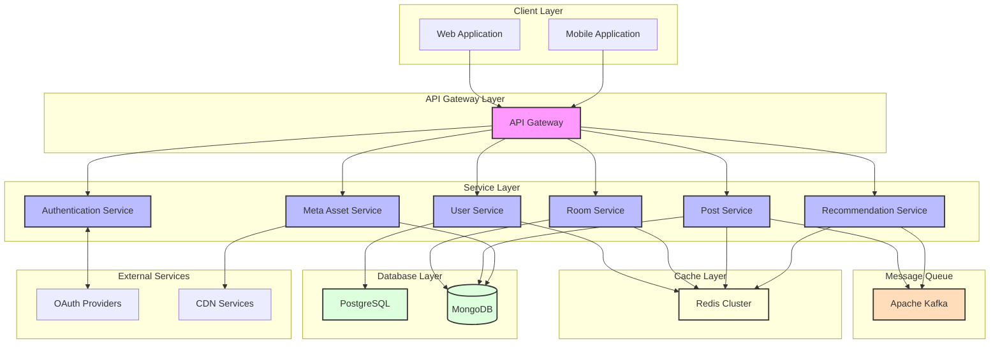

# 시스템 구성도

## 시스템 구성도 계층별 특징

### 1. Client Layer (클라이언트 레이어)

* **Web Application**: React 기반의 웹 애플리케이션
* **Mobile Application**: 모바일 웹 또는 앱 클라이언트

***

### 2. API Gateway Layer (게이트웨이 레이어)

* 모든 클라이언트 요청의 단일 진입점
* 라우팅, 로드밸런싱, 인증 처리
* API 버전 관리 및 요청/응답 변환

***

### 3. Service Layer (서비스 레이어)

각 서비스는 독립적인 마이크로서비스로 구성:

* **Authentication Service**
  * OAuth 2.0 인증 처리
  * 세션/토큰 관리
  * 사용자 권한 관리
* **User Service**
  * 사용자 프로필 관리
  * 팔로우/팔로워 관리
  * 사용자 설정 관리
* **Room Service**
  * 가상 방 생성/관리
  * 방 커스터마이징 기능
  * 방문 기록 관리
* **Post Service**
  * 게시물 CRUD
  * 태그 관리
  * 컨텐츠 필터링
* **Meta Asset Service**
  * 메타 이미지/아바타 관리
  * 에셋 제공 및 관리
  * CDN 연동
* **Recommendation Service**
  * 인기 게시물 추천
  * 맞춤형 컨텐츠 추천
  * 랜덤 방문 추천

***

### 4. Message Queue Layer (메시지 큐 레이어)

* **Apache Kafka**
  * 서비스간 비동기 통신
  * 이벤트 기반 데이터 파이프라인
  * 실시간 데이터 처리

***

### 5. Cache Layer (캐시 레이어)

* **Redis Cluster**
  * 세션 데이터 캐싱
  * 자주 접근하는 데이터 캐싱
  * 실시간 랭킹 데이터 관리

***

### 6. Database Layer (데이터베이스 레이어)

* **PostgreSQL (RDBMS)**
  * 사용자 정보
  * 권한 정보
  * 관계 데이터
* **MongoDB (NoSQL)**
  * 게시물 데이터
  * 방 커스터마이징 데이터
  * 메타 에셋 데이터

***

### 7. External Services (외부 서비스)

* **OAuth Providers**
  * 소셜 로그인 연동
  * 외부 인증 처리
* **CDN Services**
  * 메타 에셋 전송
  * 정적 리소스 제공
